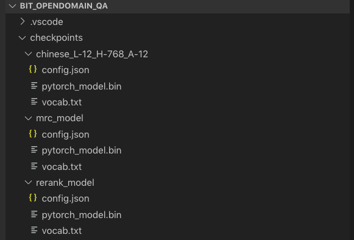

# BIT_OPENDOMAIN_QA
## Get Started for Server
1. 预训练模型地址：https://drive.google.com/open?id=1eX_hZlSdPsdXeYD1MdtFQIbo7BMeHA1g
2. 预训练模型包括：chinese_L-12_H-768_A-12, mrc_model, output三个文件夹，在BIT_OPENDOMAIN_QA建立checkpoints文件夹，并修改文件名如下图所示

3. 设定自己的config文件，包括是否使用cuda等等
4. python server.py

# BIT_OPEN_DOMAIN_QA
###### **富强，民主，文明，和谐，自由，平等，公正，法治，爱国，敬业，诚信，友善**
## Introduction
* Here is our group's project for CCF & Baidu 2019 Reading Comprehension Competition. We apply the competition models to build a open domain QA system, which can process the query-related docs from search engine and outpit short and informative answers. You can ask any questions you want here. 
* This project provide you the training scripts for LIC 2019, a demo server and the pretrained models. Weather you want to study the reading comprehension problem in DuReader dataset or build a open domain QA engine, you can find what you want here.

## Get Started
### Server
### Train
## System Architecture
### Creeper
### Mrc
### Rerank
### Choose
## TODO List
## Contributing
Clone it (https://github.com/rwei1218/BIT_OPENDOMAIN_QA.git)

Create your feature branch (git checkout -b feature/fooBar)

Commit your changes (git commit -am 'Add: Add some fooBar')

Push to the branch (git push origin feature/fooBar)
